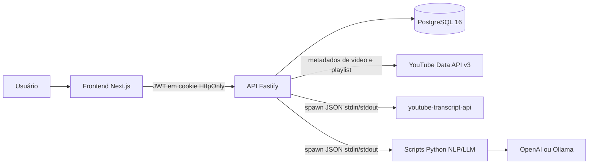
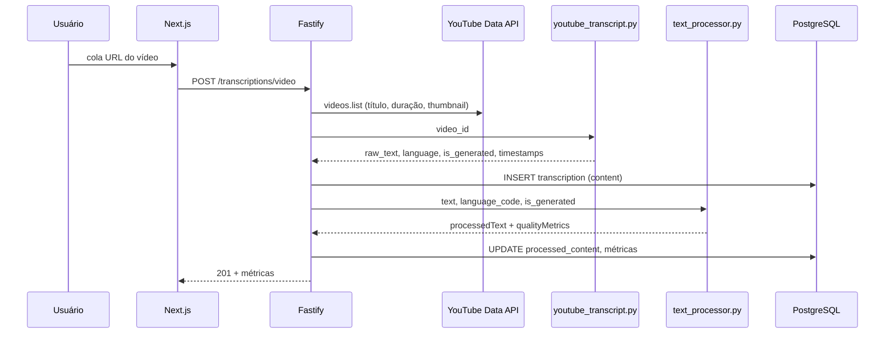
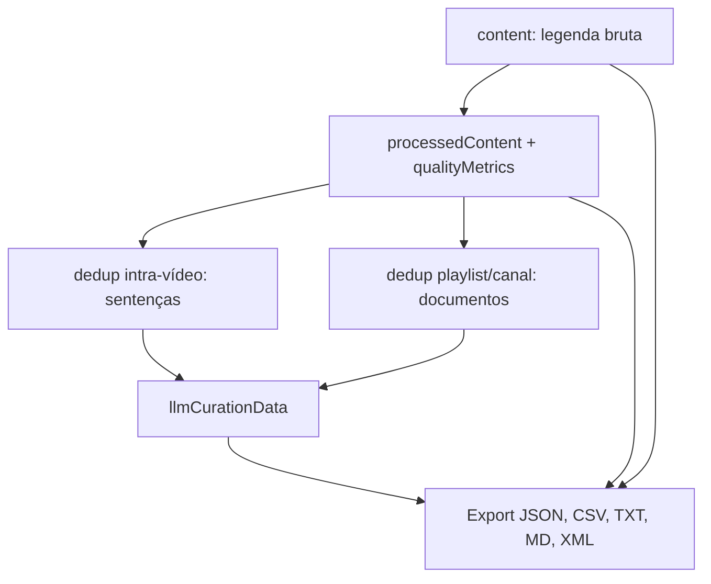

# TranscribeX: arquitetura de software e metodologia de curadoria de dados para fine-tuning

Este documento descreve a arquitetura do TranscribeX e a metodologia científica do pipeline de aquisição, limpeza, avaliação, deduplicação e curadoria semântica de transcrições. O texto foi escrito para subsidiar a seção de arquitetura e metodologia do Trabalho de Conclusão de Curso (TCC). Ele reflete o sistema implementado no código-fonte, e não apenas a intenção de produto.

O TranscribeX é uma plataforma web para capturar transcrições de vídeos e playlists do YouTube, transformá-las em texto de qualidade controlada e exportá-las como datasets prontos para treino contínuo (*continued pretraining*) ou fine-tuning supervisionado (SFT) de modelos de linguagem.

---

## 1. Contexto e problema

Transcrições de fala — em especial legendas automáticas do YouTube — são uma fonte abundante de texto, mas são ruído para treino de modelos de linguagem se usadas sem curadoria. Elas misturam hesitações, repetições, marcadores de tempo, legendas de ambiente (`[music]`, `[applause]`), trechos quase idênticos entre vídeos do mesmo canal e trechos semanticamente vazios (propaganda, conversa informal sem conteúdo).

A literatura recente em curadoria de dados para LLMs sustenta quatro pontos que orientam o sistema:

1. **A qualidade dos dados pesa mais do que o volume.** O trabalho LIMA (Zhou et al., 2023) mostrou que cerca de 1.000 exemplos cuidadosamente curados podem ser competitivos em alinhamento supervisionado.
2. **Métricas lexicais ingênuas são enviesadas pelo comprimento.** O Type-Token Ratio (TTR) correlaciona-se fortemente com o tamanho do texto e penaliza vídeos longos de forma artificial (McCarthy & Jarvis, 2010).
3. **Duplicatas enviesam o treino.** Datasets não deduplicados distorcem a distribuição de sequências raras e comuns e aumentam a memorização (Lee et al., 2022).
4. **A fidelidade ao que foi dito pesa mais do que uma reescrita gerativa.** Reescrever o texto com um modelo pode introduzir fatos que não estavam na fala. O TranscribeX julga o conteúdo e registra esse julgamento, sem gerar uma nova versão do texto.

A evolução do TranscribeX parte exatamente desse diagnóstico: a limpeza por expressões regulares e um `qualityScore` baseado em TTR são úteis como primeiro filtro de superfície, mas insuficientes como metodologia científica de curadoria. O pipeline atual, portanto, combina quatro camadas:

| Camada | Papel | Referência principal |
| --- | --- | --- |
| Limpeza de superfície | Remover ruído de fala e de legenda | Heurísticas linguísticas |
| Métricas lexicais robustas | Medir diversidade independente do comprimento | MTLD / MATTR (McCarthy & Jarvis, 2010; Covington & McFall, 2010) |
| Deduplicação exata e aproximada | Remover cópias e quase-cópias | MinHash + Jaccard (Lee et al., 2022) |
| Curadoria por LLM | Julgar conteúdo e registrar a decisão | Julgamento semântico (Zhou et al., 2023) |

---

## 2. Visão geral do sistema

O TranscribeX é um sistema cliente–servidor em três camadas:

1. **Frontend** (Next.js): interface autenticada para solicitar transcrições, inspecionar texto, disparar curadoria e exportar datasets.
2. **Backend** (Fastify + Prisma): API REST, persistência, autenticação e orquestração do pipeline.
3. **Workers Python** (processos filhos): extração de legendas do YouTube, NLP de qualidade, deduplicação e curadoria LLM.

Essa divisão é deliberada. O Node.js/TypeScript é o melhor lugar para HTTP, autenticação, validação de contratos (Zod) e chamadas à YouTube Data API v3. O Python é o melhor lugar para processamento linguístico (`langdetect`, `pyspellchecker`, `datasketch`) e para clientes de LLM (OpenAI e Ollama). A ponte entre os dois é um *runner* que spawna um processo Python, envia JSON via `stdin` e lê JSON via `stdout`.



### 2.1 O que o sistema **não** faz

É importante ser preciso para o TCC: o TranscribeX **não executa reconhecimento automático de fala (ASR)** no áudio do vídeo. Não há Whisper, wav2vec, nem extração de áudio. A “transcrição” é a **legenda já publicada no YouTube** — humana ou gerada automaticamente pela plataforma — recuperada via `youtube-transcript-api`.

Isso tem duas implicações metodológicas:

- A qualidade do texto bruto depende da qualidade da legenda de origem (`is_generated = true` ou `false`).
- O sistema se posiciona como **pipeline de curadoria de dados de fala já transcrita**, e não como motor de ASR.

---

## 3. Arquitetura de software

### 3.1 Stack tecnológica

| Camada | Tecnologia | Função |
| --- | --- | --- |
| Frontend | Next.js 16 (App Router, Turbopack), React 19, Tailwind CSS 4 | UI, Server Actions, autenticação de sessão |
| Validação no cliente | Zod, next-safe-action, React Hook Form | Contratos tipados entre UI e API |
| Componentes | Radix UI / shadcn | Acessibilidade e consistência visual |
| Backend | Fastify 5, TypeScript 5, Zod Type Provider | API HTTP, OpenAPI em `/docs` |
| Persistência | Prisma 7 + PostgreSQL 16 (`postgres:16-alpine`) | Modelo relacional e migrations |
| Auth | JWT (`@fastify/jwt`), bcryptjs, Google OAuth | Credenciais e login social |
| Integração YouTube | `googleapis` (Data API v3) + `youtube-transcript-api` | Metadados vs. legendas |
| NLP / curadoria | Python 3, `langdetect`, `pyspellchecker`, `datasketch`, `openai`, `httpx` | Pipeline científico |
| Infra local | Docker Compose (Postgres na porta **5433**) | Isolar o banco de outros serviços na máquina |

O gerenciador de pacotes é **pnpm 10**. Node.js 24 LTS. O Prisma Client é gerado em `backend/src/generated/prisma`.

### 3.2 Organização dos repositórios

O projeto é um monorepo de dois pacotes:

```
transcribe-x/
├── frontend/          # Next.js App Router
│   └── src/app/
│       ├── page.tsx                          # landing
│       ├── auth/                             # login / Google callback
│       └── dashboard/
│           ├── transcribe/                   # solicitar vídeo ou playlist
│           ├── transcriptions/[id]/          # detalhe + métricas + curadoria
│           └── playlists/[id]/               # curadoria em lote + export
└── backend/
    ├── prisma/schema.prisma
    ├── scripts/                              # workers Python
    │   ├── youtube_transcript.py
    │   ├── text_processor.py
    │   ├── deduplicator.py
    │   └── llm_curator.py
    └── src/
        ├── http/server.ts                    # bootstrap Fastify
        ├── http/routes/                      # auth, transcriptions, exports
        ├── services/                         # orquestração de domínio
        └── lib/python-runner.ts              # ponte Node ↔ Python
```

### 3.3 Padrão híbrido TypeScript + Python

A extração de playlists **não** passa por Python. O `YouTubeService` (TypeScript) chama a Data API v3 para:

- `playlists.list` — título, canal, thumbnail, contagem;
- `playlistItems.list` — paginação de 50 itens, com `nextPageToken`;
- `videos.list` — título, duração ISO-8601, estatísticas, thumbnail.

Apenas o texto da legenda é responsabilidade do script Python `youtube_transcript.py`. A justificativa de desempenho é direta: spawnar um processo Python por chamada de metadados seria custo desnecessário; a Data API já é nativa no cliente Google para Node.

Os demais scripts Python compartilham o mesmo contrato:

1. o backend serializa um payload JSON;
2. o processo Python lê `stdin`, executa, imprime um único JSON em `stdout`;
3. o backend faz parse e persiste o resultado.

Timeouts (proteção contra travamento):

| Script | Timeout |
| --- | --- |
| `youtube_transcript.py` | 30 s |
| `text_processor.py` | 15 s |
| `deduplicator.py` | 60 s |
| `llm_curator.py` | 120 s |

O *runner* resolve o interpretador na seguinte ordem: `venv/bin/python3` (se existir) → `python3` do sistema.

### 3.4 Autenticação e autorização

Há dois provedores (`AuthProvider`): `CREDENTIALS` (e-mail + senha com `bcryptjs`) e `GOOGLE` (OAuth 2.0). Após o login, a API emite um JWT. O frontend grava o token em cookie **HttpOnly**, `SameSite=Lax`, com validade de 7 dias no cookie (o JWT em si tem expiração configurável, padrão 1 hora no `env.example`).

Todas as rotas, exceto login, registro e o fluxo Google, passam por um *hook* Fastify `preHandler` que:

1. exige `Authorization: Bearer <token>`;
2. consulta uma **blacklist em memória** de tokens invalidados no logout;
3. verifica assinatura e expiração;
4. confirma que o usuário existe e está ativo (`isActive`).

O dashboard Next.js também valida a sessão no servidor (`getCurrentUser`) e redireciona para `/auth` se o cookie estiver ausente. As mutações da UI usam **Server Actions** (`next-safe-action`) que chamam a API com o token do cookie, em vez de o browser falar direto com o Fastify.

Isolamento de dados: toda consulta a transcrição, playlist, curadoria e export filtra por `userId` do JWT. Um usuário não lê nem altera o corpus de outro.

### 3.5 Modelo de dados

Entidades principais (Prisma / PostgreSQL):

**User.** Identidade, provedor de auth, `googleId`, `passwordHash`.

**Playlist.** Espelho de uma playlist do YouTube: `youtubeId`, título, canal (`channelId` / `channelTitle`), thumbnail, `videoCount`, `totalDuration`, `totalWordCount`, status.

**Transcription.** Unidade de curadoria. Campos relevantes para a metodologia:

| Campo | Papel |
| --- | --- |
| `content` | Texto bruto das legendas |
| `timestamps` | JSON dos snippets `{ text, start, duration }` |
| `processedContent` | Texto após limpeza (e, no escopo vídeo, após dedup de sentenças) |
| `qualityMetrics` | JSON com TTR, MATTR, MTLD, ruído, `qualityScore` etc. |
| `mtldScore`, `mattrScore` | Índices denormalizados para filtro/export |
| `llmCurationScore`, `llmCurationData` | Julgamento semântico do texto processado |
| `deduplicationStatus` | `pending` \| `kept` \| `duplicate` |
| `dedupGroupId` | Grupo Union-Find / canônico |
| `playlistId`, `videoIndex`, `isPlaylistVideo` | Vínculo com playlist |

**Export.** Tabela de histórico (`exports`) com o enum legado `TXT | PDF | DOCX | JSON`. O download atual não grava nessa tabela: ele é gerado sob demanda como dataset (seção 11), nos formatos JSON, CSV, TXT, MD e XML.

**RecentActivity.** Auditoria simples de ações do usuário.

Tipos de transcrição (`TranscriptionType`): `VIDEO`, `PLAYLIST`, `CHANNEL`. Status: `COMPLETED` ou `ERROR`. Não há fila assíncrona: o processamento de playlist é **síncrono e sequencial** na requisição HTTP. Vídeos individuais que falham são contabilizados, mas não abortam o restante da playlist.

---

## 4. Aquisição das transcrições

### 4.1 Fluxo de um vídeo



Passos:

1. Validar URL (`youtube.com/watch`, `youtu.be`, `/embed/`, `/v/`).
2. Buscar metadados na Data API v3.
3. Extrair o `video_id` e chamar `youtube_transcript.py`.
4. Persistência: `content` (bruto), `timestamps`, `language`, `wordCount`, `duration`.
5. Pós-processamento automático via `TextQualityService.processAndPersist`.

### 4.2 Como as legendas são obtidas

O script tenta, nesta ordem, os idiomas `en`, `pt`, `es`, `fr`, `de`. Se nenhum estiver disponível, lista os idiomas existentes e devolve erro `no_transcript` com o catálogo. Cada snippet traz:

- `text` — trecho da legenda;
- `start` — início em segundos;
- `duration` — duração do trecho.

O texto bruto (`raw_text`) é a concatenação dos snippets com espaço. `is_generated` indica se a legenda é automática (ASR do YouTube) ou humana. Essa flag controla o corretor ortográfico na etapa seguinte: só legendas automáticas passam por *spellcheck*, e apenas se o texto tiver no máximo 2.500 palavras.

Erros tratados: vídeo indisponível, ID inválido, biblioteca Python ausente, timeout, ausência de legenda.

### 4.3 Fluxo de uma playlist

`POST /transcriptions/playlist` com `{ playlistUrl }`:

1. Extrair o `list=` da URL.
2. `YouTubeService.getPlaylistDetails` + `getPlaylistVideos` (paginação de 50).
3. Criar o registro `Playlist`.
4. Para **cada** vídeo, sequencialmente:
   - buscar a legenda em Python;
   - criar `Transcription` ligada à playlist (`videoIndex` = posição);
   - rodar o processador de qualidade.
5. Atualizar `status` da playlist: `COMPLETED` se todos ok, `ERROR` se algum falhou (a mensagem indica quantos falharam).

O processamento sequencial evita saturar a API de legendas e o spawn de processos Python. Playlists grandes, porém, tornam a requisição HTTP longa — limitação conhecida, sem fila de *background jobs* nesta versão.

Escopo de canal: não há *crawler* de canal. O tipo `CHANNEL` existe no enum, e a deduplicação por canal opera sobre transcrições cuja playlist associada tem o mesmo `channelId`.

---

## 5. Pipeline de curadoria (visão ponta a ponta)

O corpus de um vídeo atravessa estágios. Cada estágio produz um artefato persistido, o que permite comparar **bruto × processado × curado** no export. O texto exportado é sempre a legenda ou o texto processado; a curadoria não gera outra versão.



Ordem operacional na interface:

1. A transcrição chega **já processada** (limpeza automática na criação).
2. O usuário pode **reprocessar** (`POST /transcriptions/:id/process`).
3. **Deduplicar** o vídeo (sentenças) e/ou a playlist/canal (documentos).
4. **Curadoria LLM** (`POST /transcriptions/:id/curate`) — pontua e recomenda, sem alterar o texto.
5. Exportar o recorte desejado, com os metadados de curadoria no mesmo registro.

A curadoria LLM **não gera texto novo**. Nenhuma etapa do pipeline reescreve a fala com um modelo.

---

## 6. Limpeza de superfície (`text_processor.py`)

O processador recebe `{ text, language_code, is_generated }` e devolve `{ processedText, qualityMetrics }`. A língua é detectada com `langdetect` (mínimo de 5 palavras); o código da legenda é *fallback*. Aliases (`pt-br` → `pt`, `en-us` → `en`, etc.) normalizam o idioma.

### 6.1 Etapas, em ordem

1. **Remoção de timestamps.** Padrões `[mm:ss]`, `(hh:mm:ss)`, `mm:ss.mmm` e similares. Conta quantos foram removidos.
2. **Anotações não verbais.** O que descreve o áudio, e não a fala.
   - Colchetes saem sempre: `[suspirando][risadas]`, `[SUSPIRANDO]`, `[music]`, `[pausa longa]`. Em legenda, colchetes são direção de cena. Um nome de falante entre colchetes também sai.
   - Parênteses e chaves saem só quando o miolo é uma direção curta (até 6 palavras, sem dígitos), com ao menos um radical de som ou ação e com as demais palavras sendo modificador (`alto`, `tocando`, `de`, `fundo`, e equivalentes em inglês, espanhol, francês e alemão). Saem `(risadas)`, `(música tocando)` e `{silêncio}`. Ficam `(como eu disse)` e `(2020)`.
   - O radical cobre conjugação e número (`suspir` pega suspiro, suspirando, suspirou), nos cinco idiomas do pipeline.
   - Notas `♪...♪` saem na mesma passagem.
   - A frase se recompor depois: espaços duplos caem na normalização, a repetição partida pelo marcador (`deixa eu [risos] deixa eu`) cai no colapso de n-gramas, e a vírgula que sobrar cai na limpeza residual.
3. **Contagem e remoção de hesitações (*fillers*).** Léxicos por idioma:

   - inglês: *uh, um, uhm, ah, er, hmm, uh-huh…*
   - português: *ah, eh, né, ne, ãh, ahn, hum, éh, hã…*
   - espanhol, francês, alemão: conjuntos equivalentes.

   O conjunto da língua detectada é unido ao inglês, para cobrir mistura de código.

4. **Colapso de repetições.** Detecta n-gramas imediatos de tamanho 3, 2 e 1 (`"vamos vamos vamos"` → `"vamos"`). Conta tokens removidos.
5. **Correção ortográfica condicional.** `pyspellchecker` só se `is_generated = true`, língua em `{en, es, fr, pt, de}` e texto ≤ 2.500 palavras. Tokens com menos de 3 letras e não alfabéticos são ignorados; a capitalização é preservada. A sugestão só entra quando a sequência de letras é a mesma — o corretor restaura acentos (`nao` → `não`, `voce` → `você`) e não troca a palavra por um vizinho de edição. Termos fora do dicionário ficam como foram falados (`frontend`, `bora`).
6. **Limpeza residual.** Roda depois do corretor e antes da normalização, porque a remoção de hesitações apaga o token e deixa a pontuação em volta (`né,` vira uma vírgula solta) e porque o corretor não mexe em tokens de uma letra (`q`, `x`).
   - Vírgula que não está entre duas palavras: vírgula inicial, `,,` e vírgula imediatamente antes de `.!?;:`.
   - Letra isolada que não é palavra funcional da língua detectada. Listas: português `a à e é o ó`; inglês `a i`; espanhol `a e o y`. Língua fora dessa lista usa a união das três, para não apagar uma palavra funcional quando a detecção falha.
7. **Normalização de sentenças.** Espaços, reticências, pontuação colada, capitalização da primeira letra de cada sentença, ponto final se ausente. Só acontece depois da limpeza residual, para não capitalizar uma vírgula órfã (` , bom` não vira `, Bom`).

O resultado é `processedContent`. O bruto permanece em `content`, o que torna o pipeline **reversível** para comparação experimental.

Há um modo `analyze_only`: calcula as mesmas métricas **sem alterar o texto**. Bruto e processado passam pela mesma função, cada um sobre o próprio texto. O `reference_text` só alimenta a taxa de redução de ruído. Essa taxa fica fora do score, salvo a penalidade quando a redução passa de 0,75.

---

## 7. Métricas de qualidade textual

Cada versão — bruto e processado — recebe a mesma função sobre o próprio texto. A taxa de ruído é o número que compara duas versões. Ela fica fora do score, salvo a penalidade quando a redução passa de 0,75.

### 7.1 Inventário

| Métrica | Símbolo / campo | O que mede |
| --- | --- | --- |
| Contagem de palavras original / processada | `originalWordCount`, `processedWordCount` | Volume |
| Taxa de redução de ruído | `noiseReductionRate` | Fração de tokens removidos |
| TTR | `lexicalDiversity` | Diversidade bruta (enviesada pelo comprimento) |
| MATTR | `mattrScore` | Diversidade em janela móvel |
| MTLD | `mtldScore` | Diversidade por fatores de TTR |
| Comprimento médio de sentença | `avgSentenceLength` | Fluência / fragmentação |
| Hesitações | `hesitationCount` | *Fillers* antes da remoção |
| Repetições | `repetitionCount` | Tokens colapsados |
| Timestamps removidos | `timestampMarkersRemoved` | Ruído de legenda |
| Taxa de artefatos | `artifactRate` | Vírgulas órfãs + letras soltas, sobre o número de tokens |
| Vírgulas órfãs | `residualCommaCount` | Vírgulas que não ligam duas palavras |
| Letras soltas | `residualLetterCount` | Letras isoladas fora da lista funcional da língua |
| Idioma detectado | `detectedLanguage` | `langdetect` |
| Tempo de processamento | `processingDurationMs` | Custo operacional |
| Score de limpeza | `qualityScore` | Heurística interna ∈ [0, 1], sem o termo de ruído |

Tokenização: regex Unicode `[^\W\d_]+(?:['’-][^\W\d_]+)*`, ou seja, palavras com hífen e apóstrofo, sem dígitos.

### 7.2 Type-Token Ratio (TTR)

\[
\mathrm{TTR} = \frac{|\{t : t \in \text{tokens}\}|}{N}
\]

onde \(N\) é o número de tokens. O TTR **permanece no JSON** por retrocompatibilidade e aparece na UI rotulado como “TTR (enviesado)”. Ele **não entra mais** no `qualityScore`.

### 7.3 MATTR — Moving Average Type-Token Ratio

Covington & McFall (2010). Janela \(w = 50\) tokens:

\[
\mathrm{MATTR} =
\begin{cases}
\mathrm{TTR} & \text{se } N < w \\
\dfrac{1}{N-w+1} \displaystyle\sum_{i=0}^{N-w} \dfrac{|\{t_i,\ldots,t_{i+w-1}\}|}{w} & \text{caso contrário}
\end{cases}
\]

A média de TTRs locais reduz o viés de comprimento: um vídeo de 40 minutos deixa de ser penalizado só por ser longo.

### 7.4 MTLD — Measure of Textual Lexical Diversity

McCarthy & Jarvis (2010). Percorre o texto acumulando tipos até o TTR cair ao limiar \(0{,}72\); cada queda conta um *factor*. O fator residual do trecho final é fracionário:

\[
f_{\text{parcial}} = \frac{1 - \mathrm{TTR}_{\text{restante}}}{1 - 0{,}72}
\]

O MTLD de uma direção é \(N / \sum f\). O valor reportado é a **média bidirecional** (frente e reverso), o que reduz o efeito da ordem do discurso. Textos com menos de 10 tokens recebem `mtldScore = null`: a medida não está definida, e um zero seria lido na interface como pontuação pior.

MATTR e MTLD são persistidos e exibidos, mas **não entram** no score de limpeza. Os dois medem variedade de formas. Um erro único de legenda automática é um hapax: removê-lo diminui o número de tipos e pode fazer MATTR ou MTLD cair mesmo quando o texto ficou mais limpo. Uma queda depois do processamento, portanto, não é por si evidência de degradação.

### 7.5 Score de comprimento de sentença

Sentenças muito curtas (legenda picotada) e muito longas (ausência de pontuação) são penalizadas. Seja \(\bar{s}\) o número médio de palavras por sentença:

\[
S(\bar{s}) =
\begin{cases}
0 & \bar{s} \le 0 \\
\bar{s}/8 & \bar{s} < 8 \\
1 & 8 \le \bar{s} \le 25 \\
\max\bigl(0,\; 1 - (\bar{s}-25)/40\bigr) & \bar{s} > 25
\end{cases}
\]

A faixa 8–25 palavras é a “zona de fluência” adotada como heurística para transcrição de fala já pontuada.

### 7.6 Score de limpeza

O score é calculado só sobre o texto da versão em avaliação. Sejam \(a\) a taxa de artefatos e \(f\) a taxa de resíduos de fala (hesitações ainda presentes mais repetições imediatas de token), ambas divididas pelo número de tokens e limitadas a 1:

\[
Q = 0{,}4 \cdot S(\bar{s}) + 0{,}3 \cdot (1 - a) + 0{,}3 \cdot (1 - f)
\]

depois clipado em \([0, 1]\).

Interpretação dos pesos:

- **40% fluência de sentença:** a zona 8–25 palavras já definida acima.
- **30% ausência de artefatos:** vírgulas órfãs e letras soltas.
- **30% ausência de resíduo de fala:** fillers e repetição imediata que ainda estão no texto.

A taxa de redução de ruído \(r\) fica fora de \(Q\). No bruto ela é sempre 0, porque a análise compara o texto consigo mesmo; usá-la como termo \((1-r)\) dava um bônus automático à aba Bruto e penalizava exatamente a limpeza que o pipeline deveria fazer. \(r\) continua no JSON e na interface como diagnóstico de quanto o processamento removeu.

Há uma penalidade à parte só quando a redução passa de 0,75 — filtro agressivo demais, não um prêmio para quem não removeu nada:

\[
Q \leftarrow Q \cdot \left(1 - \frac{r - 0{,}75}{0{,}25}\right) \quad \text{se } r > 0{,}75
\]

**Limitação científica (importante para o TCC):** esses pesos **não foram calibrados** contra um critério externo (desempenho de fine-tuning ou julgamento humano). São uma heurística operacional para ranquear na UI. A validação empírica forte, prevista na metodologia do trabalho, é o experimento de treino comparando datasets (`raw` vs `processed` vs `curated`), não o \(Q\) interno. Por isso a interface também exibe MATTR, MTLD e o julgamento do LLM em separado.

Registros já gravados conservam o score antigo até um reprocessamento.

### 7.7 Por que o bruto pontuava acima do processado

A comparação anterior misturava três efeitos:

1. **O score premiava o bruto por construção.** O termo \((1-r)\) valia 1 no bruto (\(r = 0\)) e caía no processado à medida que hesitações e repetições saíam. Com MATTR idêntico e 15% dos tokens removidos, o score caía mesmo sem piora lexical.
2. **Diversidade lexical conta ruído como riqueza.** MATTR (janela 50) e MTLD (limiar 0,72, média bidirecional) estão implementados como em Covington & McFall e McCarthy & Jarvis. Eles medem variedade de formas. Fillers raros e erros únicos de ASR aumentam o número de tipos; removê-los pode reduzir MATTR e MTLD. Isso não significa que o processamento piorou o texto para fine-tuning.
3. **MTLD curto virava zero.** Abaixo de 10 tokens a função devolvia 0. Um texto de 11 palavras que perdia dois fillers passava a exibir MTLD 0, lido como colapso de qualidade.

O protocolo de comparação, depois da correção:

- a mesma função pontua cada versão sobre o próprio texto;
- \(r\) é só o delta de tokens do processamento, quando há `reference_text`;
- artefatos entram em \(Q\) e devem cair no texto processado;
- MATTR e MTLD permanecem no relatório como diagnóstico de diversidade, com a leitura explícita de que uma queda pode ser remoção de hapax.

---

## 8. Deduplicação

Implementação: `backend/scripts/deduplicator.py` + `TextDedupService`. Inspiração: Lee et al. (2022), *Deduplicating Training Data Makes Language Models Better*.

### 8.1 Por que duas noções de duplicata

Transcrições de um mesmo canal repetem *slogans*, introduções (“seja bem-vindo de volta”), CTAs e trechos de aula regravada. Duplicata **exata** captura cópia literal. Duplicata **aproximada** captura parafraseio raso e recortes quase iguais.

### 8.2 Normalização

Antes de qualquer hash, o texto é tokenizado em minúsculas (mesma regex de palavras). Isso faz `"Olá, mundo!"` e `"ola mundo"` colidirem na duplicata exata.

### 8.3 Duplicata exata

SHA-256 do texto normalizado. Segmentos com o mesmo digest entram no mesmo *bucket* e são unidos por Union-Find.

### 8.4 Quase-duplicata: MinHash + LSH + Jaccard

1. Gerar **n-gramas de palavras** (padrão \(n = 3\), configurável por `DEDUP_NGRAM_SIZE`).
2. Assinatura **MinHash** com 128 permutações (`datasketch.MinHash`).
3. Índice **LSH** com limiar de Jaccard configurável (`DEDUP_JACCARD_THRESHOLD`, padrão \(0{,}8\)).
4. Para cada candidato do LSH, confirmar

   \[
   J(A,B) = \frac{|A \cap B|}{|A \cup B|} \ge \tau
   \]

   na própria assinatura MinHash (estimativa). Pares já marcados como exatos são ignorados.

5. Union-Find agrupa componentes conexas.

O canônico de um grupo é o membro de **maior comprimento de texto** (empate: maior `id`). Os demais recebem `kind = exact` ou `kind = near`.

### 8.5 Três escopos

| Escopo | Endpoint | Unidade comparada | Efeito |
| --- | --- | --- | --- |
| Vídeo | `POST /transcriptions/:id/deduplicate` | sentenças do próprio texto | reescreve `processedContent` removendo sentenças duplicadas; status `kept` |
| Playlist | `POST /transcriptions/playlists/:id/deduplicate` | documentos (um vídeo = um segmento) | marca `duplicate` / `kept` + `dedupGroupId`; **não apaga** o texto |
| Canal | `POST /transcriptions/channels/:channelId/deduplicate` | documentos de playlists com aquele `channelId` | igual à playlist |

No escopo vídeo, as sentenças são fatiadas por `(?<=[.!?])\s+`. IDs artificiais `{transcriptionId}:{índice}` identificam cada sentença no script Python.

No escopo playlist/canal o texto **não é apagado**: duplicatas são apenas marcadas. O export, por padrão, **omite** `deduplicationStatus = duplicate`. Isso preserva a reversibilidade e permite medir quantos itens o filtro retirou (`skippedDuplicates`).

Parâmetros padrão alinhados à prática de n-gramas de 3 palavras e Jaccard \(0{,}8\) — limiar conservador, privilegiando precisão sobre recall (menos falsos positivos).

---

## 9. Curadoria assistida por LLM

Implementação: `llm_curator.py` + `LlmCurationService`. A curadoria é um **juiz semântico**, não um reescritor.

### 9.1 Motivação

Regex e MATTR não distinguem uma aula densa de um *vlog* coerente porém vazio, nem detectam contradições. Um LLM avalia três eixos que a literatura de curadoria de SFT considera relevantes: estrutura do discurso, densidade informacional e plausibilidade factual aparente.

### 9.2 Provedores

Configuração (`CURATION_LLM_PROVIDER`):

| Variável | Padrão | Papel |
| --- | --- | --- |
| `CURATION_LLM_PROVIDER` | `openai` | Provedor primário |
| `OPENAI_MODEL` | `gpt-4o-mini` | Modelo de API |
| `OLLAMA_BASE_URL` | `http://localhost:11434` | Fallback local |
| `OLLAMA_MODEL` | `llama3` | Modelo local |

Se o provedor primário falha, o script tenta o outro (OpenAI ↔ Ollama). Temperatura \(0{,}2\) e `response_format: json_object` (OpenAI) / `format: json` (Ollama) para reduzir variação e forçar JSON.

A escolha de **GPT-4o-mini** segue o critério custo–qualidade para um juiz de dataset: é barato o suficiente para corpus de playlists e estável em JSON estruturado. Llama 3 via Ollama cobre o cenário sem chave de API (reprodutibilidade local no laboratório).

### 9.3 Entrada

O texto enviado é o `processedContent` (fallback: `content`). Truncamento em **6.000 caracteres**, cortando na última palavra, para caber no contexto e padronizar custo. Título e código de língua vão no cabeçalho do *prompt*.

### 9.4 *Prompt* do juiz

O sistema pede um JSON com:

- `coherence` (0–10): coerência semântica e estrutura do discurso;
- `richness` (0–10): densidade e valor informacional;
- `factuality` (0–10): correção factual **aparente** (contradições, afirmações vazias, tom alucinatório) — **não** é verificação contra uma base de conhecimento externa;
- `recommendation`: `sft_example` | `pretraining` | `discard`;
- `rationale`: uma ou duas frases no idioma do texto.

Critério de recomendação, explícito no *prompt*:

- **`sft_example`:** conteúdo instrucional ou explicativo, auto-contido, de alta qualidade — candidato a par instrução–resposta.
- **`pretraining`:** texto contínuo coerente, porém menos estruturado como exemplo de SFT.
- **`discard`:** ruído, propaganda, conversa vazia, fragmento incoerente.

### 9.5 Agregação

Cada nota é limitada a \([0, 10]\). O overall é a média aritmética:

\[
\mathrm{overall} = \frac{c + r + f}{3}
\]

O campo persistido `llmCurationScore` é \(\mathrm{overall}/10\), para ficar na mesma escala \([0, 1]\) do `qualityScore`. O JSON completo (`provider`, `model`, notas, recomendação, justificativa) fica em `llmCurationData`.

### 9.6 O que a curadoria não faz

- Não altera `processedContent`.
- Não é *grounding* factual (não consulta web nem o vídeo).
- Não substitui a deduplicação: um texto duplicado pode receber nota alta e mesmo assim deve ser filtrado no export.

---

## 10. Fidelidade ao texto original

O pipeline não reescreve a transcrição com um modelo. O campo `text` de qualquer export é `content` (estágio `raw`) ou `processedContent` (estágios `processed` e `curated`, com fallback para `content`).

A curadoria LLM permanece como julgamento: notas, recomendação, justificativa, provedor e modelo saem junto com o texto, para o consumidor filtrar exemplos sem que o conteúdo da fala seja substituído por uma geração. A recomendação `sft_example` ou `pretraining` indica o uso sugerido; ela não produz pares instrução–resposta nem uma prosa alternativa.

---

## 11. Exportação para fine-tuning

Endpoint: `GET /exports/fine-tuning`.

Todo arquivo baixado é um dataset do estágio escolhido. Os cinco formatos carregam os mesmos campos; o que muda é só a serialização. PDF, DOCX e JSONL não fazem parte da exportação.

### 11.1 Parâmetros

| Query | Valores | Efeito |
| --- | --- | --- |
| `scope` | `user` \| `playlist` \| `transcription` | Corpus do usuário, de uma playlist ou de um vídeo |
| `playlistId` | UUID | Obrigatório se `scope=playlist` |
| `transcriptionId` | UUID | Obrigatório se `scope=transcription` |
| `dataset` | `raw` \| `processed` \| `curated` | Qual versão do texto |
| `format` | `json` \| `csv` \| `txt` \| `md` \| `xml` | Serialização; o padrão é `json` |
| `includeDuplicates` | `true` \| `false` | Incluir itens `duplicate` |

### 11.2 Regras de inclusão

- **`raw`:** `content`. Duplicatas omitidas por padrão.
- **`processed`:** `processedContent` (fallback `content`).
- **`curated`:** exige `llmCurationData`; **exclui** `recommendation = discard`. O texto continua sendo o processado.

Contadores `skippedDuplicates` e `skippedDiscarded` voltam na resposta para o relatório experimental.

### 11.3 Campos

Cada registro, em qualquer formato, tem exatamente estas chaves, sempre presentes. Valor ausente é `null` (JSON e Markdown), string vazia (CSV e TXT) ou elemento vazio (XML):

`id`, `title`, `youtubeId`, `playlistId`, `language`, `dataset`, `deduplicationStatus`, `dedupGroupId`, `qualityScore`, `mtldScore`, `mattrScore`, `llmCurationScore`, `recommendation`, `coherence`, `richness`, `factuality`, `curationOverall`, `curationRationale`, `curationProvider`, `curationModel`, `curationChunkCount`, `text`.

`text` é o único campo de conteúdo. Os demais campos de curadoria repetem o julgamento do LLM e o grupo de deduplicação quando essas etapas já rodaram; ficam vazios no caso contrário. Isso permite filtrar *a posteriori* por limiar de MATTR, nota do juiz ou recomendação sem reprocessar o corpus.

### 11.4 Formatos

**JSON** (`application/json`). Array de registros.

```json
[
  {
    "id": "...",
    "title": "...",
    "youtubeId": "...",
    "playlistId": "...",
    "language": "pt",
    "dataset": "curated",
    "deduplicationStatus": "kept",
    "dedupGroupId": "...",
    "qualityScore": 0.9,
    "mtldScore": 50,
    "mattrScore": 0.8,
    "llmCurationScore": 0.88,
    "recommendation": "sft_example",
    "coherence": 9,
    "richness": 8,
    "factuality": 9,
    "curationOverall": 8.7,
    "curationRationale": "...",
    "curationProvider": "openai",
    "curationModel": "gpt-4o-mini",
    "curationChunkCount": 1,
    "text": "..."
  }
]
```

**CSV** (`text/csv`). Cabeçalho fixo na ordem dos campos acima. Células com vírgula, aspas ou quebra de linha vão entre aspas, com aspas internas duplicadas.

**TXT** (`text/plain`). Cabeçalho `# dataset:` e `# records:`. Cada exemplo fica entre `<<<RECORD>>>` e `<<<END>>>`. Escalares em `chave: valor`. `text` em bloco `text<<<` … `>>>`. Uma linha de conteúdo que seja exatamente `>>>`, `<<<RECORD>>>` ou `<<<END>>>` é prefixada com `\`.

```text
# dataset: curated
# records: 1

<<<RECORD>>>
id: ...
title: ...
youtubeId: ...
playlistId: ...
language: pt
dataset: curated
deduplicationStatus: kept
dedupGroupId: ...
qualityScore: 0.9
mtldScore: 50
mattrScore: 0.8
llmCurationScore: 0.88
recommendation: sft_example
coherence: 9
richness: 8
factuality: 9
curationOverall: 8.7
curationRationale: ...
curationProvider: openai
curationModel: gpt-4o-mini
curationChunkCount: 1
text<<<
...
>>>
<<<END>>>
```

**MD** (`text/markdown`). Cabeçalho com estágio e contagem. Cada registro abre com front matter dos campos escalares e segue com a seção `## text`.

```markdown
# Dataset

- stage: curated
- records: 1

---
id: "..."
title: "..."
youtubeId: "..."
playlistId: "..."
language: "pt"
dataset: "curated"
deduplicationStatus: "kept"
dedupGroupId: "..."
qualityScore: 0.9
mtldScore: 50
mattrScore: 0.8
llmCurationScore: 0.88
recommendation: "sft_example"
coherence: 9
richness: 8
factuality: 9
curationOverall: 8.7
curationRationale: "..."
curationProvider: "openai"
curationModel: "gpt-4o-mini"
curationChunkCount: 1
---

## text

...
```

**XML** (`application/xml`). Raiz `<dataset recordCount="N" stage="...">`. Cada exemplo é um `<record>` e cada campo é um elemento, com texto escapado. Não há atributo de conteúdo no registro.

```xml
<?xml version="1.0" encoding="UTF-8"?>
<dataset recordCount="1" stage="curated">
  <record>
    <id>...</id>
    <title>...</title>
    <youtubeId>...</youtubeId>
    <playlistId>...</playlistId>
    <language>pt</language>
    <dataset>curated</dataset>
    <deduplicationStatus>kept</deduplicationStatus>
    <dedupGroupId>...</dedupGroupId>
    <qualityScore>0.9</qualityScore>
    <mtldScore>50</mtldScore>
    <mattrScore>0.8</mattrScore>
    <llmCurationScore>0.88</llmCurationScore>
    <recommendation>sft_example</recommendation>
    <coherence>9</coherence>
    <richness>8</richness>
    <factuality>9</factuality>
    <curationOverall>8.7</curationOverall>
    <curationRationale>...</curationRationale>
    <curationProvider>openai</curationProvider>
    <curationModel>gpt-4o-mini</curationModel>
    <curationChunkCount>1</curationChunkCount>
    <text>...</text>
  </record>
</dataset>
```

A playlist, a página da transcrição e os jobs disparam esse endpoint. O seletor de estágio (`raw` / `processed` / `curated`) continua disponível; o padrão da tela é o estágio mais avançado já produzido. O download explícito de um vídeo envia `includeDuplicates=true`, para o arquivo não sair vazio só porque aquele item foi marcado como duplicata. A exportação da playlist mantém a omissão padrão.

---

## 12. Interface e experiência do pesquisador

O frontend não é apenas vitrine: ele materializa a metodologia.

**Dashboard / Transcrever.** Campo único que detecta URL de vídeo ou playlist e cria o job correspondente. Jobs de playlist aparecem em acordeão, com os vídeos filhos.

**Página da transcrição (`/dashboard/transcriptions/[id]`).**

- Abas de texto: **Original** e **Processado**.
- Painel **Relatório de qualidade**: \(Q\), ruído (diagnóstico, fora do score), TTR enviesado, MATTR, MTLD, taxa de artefatos, vírgulas órfãs, letras soltas, hesitações, repetições, timestamps, língua. Abas Bruto e Processado usam a mesma função, cada uma sobre o próprio texto. A curadoria LLM aparece no texto processado.
- Ações: Reprocessar, Deduplicar segmentos e Curadoria LLM.
- Exportar dataset (JSON, CSV, TXT, MD, XML) no estágio Original ou Processado.

**Página da playlist (`/dashboard/playlists/[id]`).**

- Lista de vídeos com status de dedup e nota de curadoria.
- Botão de deduplicação da playlist e curadoria dos pendentes.
- Export de fine-tuning com seletor de estágio (Bruto, Processado, Curado) e de formato (JSON, CSV, TXT, MD, XML).

Fluxo de tela alinhado ao fluxo científico: o pesquisador vê o bruto e o processado lado a lado, com o julgamento da curadoria, antes de baixar o dataset.

---

## 13. Contratos da API (resumo)

Prefixo autenticado, salvo auth. Documentação OpenAPI em `http://localhost:3333/docs`.

| Método | Rota | Função |
| --- | --- | --- |
| `POST` | `/auth/login` | JWT por e-mail/senha |
| `POST` | `/auth/register` | Cadastro |
| `GET` | `/auth/google` | Início OAuth |
| `GET` | `/auth/google/callback` | Callback OAuth |
| `GET` | `/auth/me` | Usuário corrente |
| `POST` | `/auth/logout` | Blacklist do token |
| `POST` | `/transcriptions/video` | Criar transcrição de vídeo |
| `POST` | `/transcriptions/playlist` | Criar transcrições de playlist |
| `GET` | `/transcriptions` | Listar |
| `GET` | `/transcriptions/:id` | Detalhe completo (métricas e curadoria) |
| `POST` | `/transcriptions/:id/process` | Reexecutar limpeza |
| `POST` | `/transcriptions/:id/deduplicate` | Dedup de sentenças |
| `POST` | `/transcriptions/playlists/:id/deduplicate` | Dedup da playlist |
| `POST` | `/transcriptions/channels/:channelId/deduplicate` | Dedup do canal |
| `POST` | `/transcriptions/:id/curate` | Juiz LLM |
| `GET` | `/transcriptions/playlists` | Playlists do usuário |
| `GET` | `/transcriptions/playlists/:id` | Playlist + vídeos |
| `GET` | `/exports/fine-tuning` | Dataset de treino |

---

## 14. Configuração relevante à metodologia

Além de banco, JWT e chaves Google/YouTube:

```
CURATION_LLM_PROVIDER=openai   # ou ollama
OPENAI_API_KEY=...
OPENAI_MODEL=gpt-4o-mini
OLLAMA_BASE_URL=http://localhost:11434
OLLAMA_MODEL=llama3
DEDUP_JACCARD_THRESHOLD=0.8
DEDUP_NGRAM_SIZE=3
```

Reprodutibilidade: o mesmo corpus, com as mesmas variáveis, deve produzir o mesmo conjunto de hashes de duplicata exata. MinHash é estocástico na construção das permutações da biblioteca, mas o limiar e o \(n\) ficam fixos no ambiente. A curadoria **não é determinística** (temperatura 0,2); por isso `provider` e `model` são persistidos em cada registro e saem no dataset, e o TCC deve reportar o modelo juiz utilizado.

---

## 15. Metodologia experimental sugerida para o TCC

O software entrega três versões do mesmo corpus, todas fiéis à fala transcrita. A validação empírica forte — prevista desde o desenho da evolução do pré-processamento — é **externa ao aplicativo**: treinar e comparar modelos.

Protocolo recomendado (ainda que o treino LoRA não esteja implementado no TranscribeX):

1. Escolher um domínio (ex.: playlist educacional de um canal).
2. Exportar três JSONs: `raw`, `processed` e `curated`.
3. Registrar, para cada export, `recordCount`, `skippedDuplicates`, `skippedDiscarded` e o modelo juiz (`curationProvider`, `curationModel`).
4. Fine-tuning piloto com o **mesmo** modelo-base e o **mesmo** orçamento (ex.: LoRA em Llama 3 8B).
5. Avaliar em conjunto de validação separado:
   - perplexidade (pré-treino / linguagem);
   - tarefa alvo, filtrando pelo campo `recommendation` quando o uso for SFT;
   - juiz LLM e/ou avaliação humana em amostra.
6. Reportar também as métricas internas (MATTR, MTLD, notas de coerência/riqueza/factualidade) como **descritivas**, não como prova de superioridade.

Esse desenho atende ao argumento de que um `qualityScore` interno não substitui evidência de treino (Zhou et al., 2023).

---

## 16. Limitações

1. **Não há ASR próprio.** A cobertura depende de o YouTube oferecer legenda no vídeo.
2. **Playlist síncrona.** Playlists grandes podem estourar timeout HTTP; não há fila.
3. **Factualidade aparente.** O juiz LLM não verifica fatos contra o mundo; apenas penaliza incoerência e vazio.
4. **Pesos do \(Q\)** são heurísticos.
5. **Deduplicação lexical, não semântica profunda.** MinHash sobre n-gramas não captura paráfrases distantes; embeddings do tipo BGE-M3 foram considerados no desenho e ficaram fora desta versão, em favor de um método clássico, barato e citável (Lee et al., 2022).
6. **Truncamento da curadoria em 6.000 caracteres.** Vídeos longos são julgados por um prefixo.
7. **Créditos / billing.** Não há sistema de créditos no código atual (mencionado apenas em documentação antiga de playlist).

---

## 17. Referências metodológicas

As referências abaixo fundamentam escolhas de implementação. Completar com dados bibliográficos oficiais na versão final do TCC.

- **McCarthy, P. M., & Jarvis, S. (2010).** *MTLD, vocd-D, and HD-D: A validation study of sophisticated approaches to lexical diversity assessment.* Behavior Research Methods. — Substituição do TTR por MTLD; limiar 0,72 usado no código.
- **Covington, M. A., & McFall, J. D. (2010).** *Cutting the Gordian knot: The moving-average type–token ratio (MATTR).* Journal of Quantitative Linguistics. — MATTR com janela fixa.
- **Lee, K. et al. (2022).** *Deduplicating Training Data Makes Language Models Better.* ACL. — Deduplicação exata e aproximada; efeito sobre memorização e distribuição.
- **Zhou, C. et al. (2023).** *LIMA: Less Is More for Alignment.* — Qualidade supera quantidade em SFT.

---

## 18. Mapa código ↔ metodologia

| Conceito do TCC | Onde está no código |
| --- | --- |
| Extração de legendas | `backend/scripts/youtube_transcript.py`, `transcription-service.ts` |
| Metadados YouTube | `backend/src/services/youtube-service.ts` |
| Playlist | `playlist-transcription-service.ts` |
| Limpeza e métricas | `backend/scripts/text_processor.py`, `text-quality-service.ts` |
| Ponte Node–Python | `backend/src/lib/python-runner.ts` |
| Deduplicação | `backend/scripts/deduplicator.py`, `text-dedup-service.ts` |
| Curadoria LLM | `backend/scripts/llm_curator.py`, `llm-curation-service.ts` |
| Export de dataset | `dataset-serializer.ts`, `fine-tuning-export-service.ts`, `export-fine-tuning.ts` |
| Schema | `backend/prisma/schema.prisma` |
| UI de métricas | `quality-metrics-panel.tsx` |
| UI de texto Original / Processado | `transcript-content.tsx` |
| UI de export da playlist | `playlist-curation-panel.tsx` |

Este documento descreve o sistema **como implementado**. Alterações futuras (fila assíncrona, ASR próprio, embeddings semânticos, treino LoRA integrado) devem ser registradas como trabalho futuro, não como capacidade atual.
